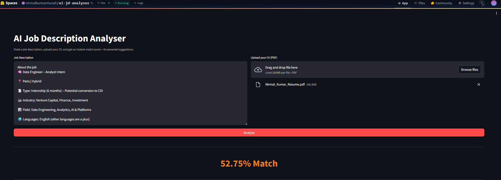
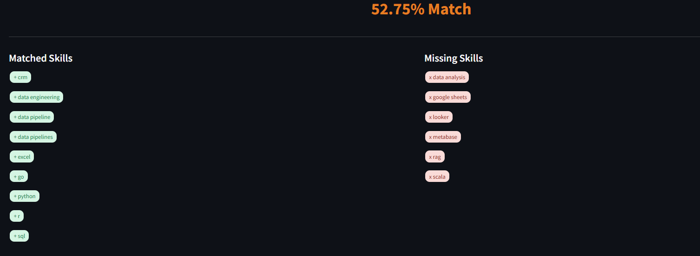
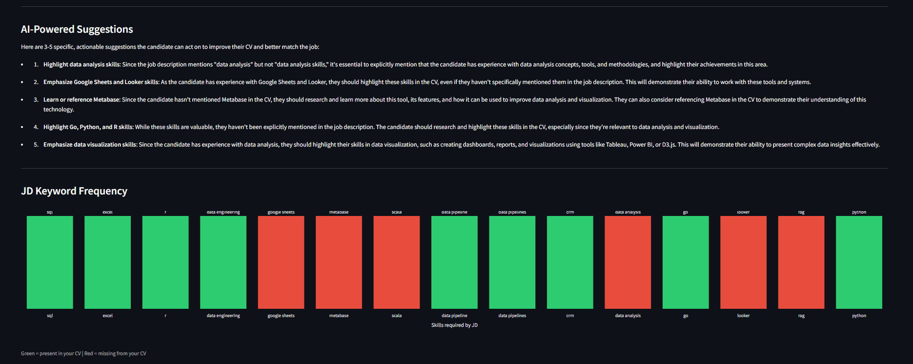

# 🤖 AI Job Description Analyser

> Paste any job description → get your CV match score, skill gaps, and actionable improvement suggestions — instantly.


---

## 📌 Overview

Job descriptions are dense. Recruiters scan CVs in seconds. This tool bridges that gap — it parses a job description, extracts required skills, compares them against your CV, and tells you exactly what to fix before you apply.

Built as part of a data science portfolio to demonstrate end-to-end NLP, text similarity, and applied ML skills.

---
## 📸 Screenshots

### App Interface


### Match Score & Skill Gap


### AI Suggestions & Keyword Chart


## 🚀 Features

| Feature | Description |
|---|---|
| 📄 JD Parser | Extracts skills, keywords, experience level from any job description |
| 📋 CV Matcher | Uploads your CV and scores similarity against the JD |
| 📊 Gap Analyser | Shows matched skills vs missing skills clearly |
| 💡 Insight Generator | Suggests specific improvements to your CV text |
| 🖥️ Streamlit Dashboard | Clean interactive UI with charts and keyword cloud |

---

## 🛠️ Tech Stack

- **Language**: Python 3.10+
- **NLP**: spaCy, NLTK
- **ML**: scikit-learn (TF-IDF, cosine similarity)
- **PDF Parsing**: pdfplumber, PyMuPDF
- **Visualization**: Plotly, WordCloud, Matplotlib
- **Web App**: Streamlit
- **API**: Hugging Face Inference API (Novita provider)

---

## 📁 Project Structure
```

ai-jd-analyser/
│
├── app/
│   └── main.py              # Streamlit app entry point
│
├── utils/
│   ├── jd_parser.py         # JD text cleaning + skill extraction
│   ├── cv_parser.py         # CV PDF parsing + text extraction
│   ├── matcher.py           # TF-IDF similarity + gap analysis
│   └── insights.py          # Suggestion generator (LLM-powered)
│
├── data/
│   └── (sample JDs for testing)
│
├── tests/
│   └── test_parser.py
│
├── .env.example             # API key template
├── requirements.txt
└── README.md
```

---

## ⚙️ Setup

```bash
# 1. Clone the repo
git clone https://github.com/nirmalkumarmurali/ai-jd-analyser.git
cd ai-jd-analyser

# 2. Create virtual environment
python -m venv venv
source venv/bin/activate  # Windows: venv\Scripts\activate

# 3. Install dependencies
pip install -r requirements.txt
python -m spacy download en_core_web_sm

# 4. Add API key
cp .env.example .env
# Edit .env and add your HUGGINGFACE_API_KEY

# 5. Run the app
streamlit run app/main.py
```

---

## 📈 How It Works

1. **Input** — Paste a job description + upload your CV (PDF)
2. **Parse** — spaCy extracts skills and keywords from both
3. **Score** — TF-IDF + cosine similarity calculates match %
4. **Analyse** — Matched vs missing skills are listed
5. **Suggest** — LLM-powered improvement tips via Hugging Face API

---

## 🔭 Roadmap

- [x] Project setup & structure
- [x] JD Parser (Step 2)
- [x] CV Parser (Step 3)
- [x] Match Engine (Step 4)
- [x] Insight Generator (Step 5)
- [x] Streamlit UI (Step 6)
- [x] Testing with real JDs (Step 7)
- [x] Deploy to Hugging Face Spaces (Step 8)

---

## 👤 Author

**Nirmal** — Data Science & Analytics | EPITA Paris  
[Portfolio](https://nirmalkumarmurali.github.io/portfolio/) · [GitHub](https://github.com/nirmalkumarmurali) · [LinkedIn](https://www.linkedin.com/in/nirmal-kumar-murali/)
